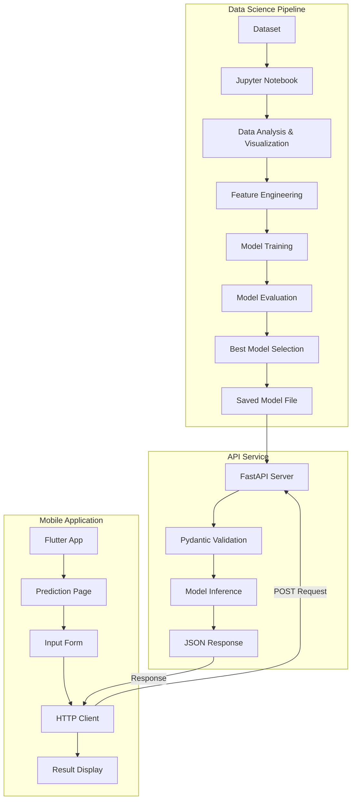

# Design Document

## Overview

This design document outlines the architecture and implementation approach for integrating a machine learning linear regression feature into the MedMind application. The solution consists of three main components:

1. **ML Pipeline**: A Jupyter notebook for data analysis, model training, and evaluation
2. **FastAPI Service**: A REST API that serves model predictions with validation
3. **Flutter Integration**: A prediction page integrated into the existing MedMind mobile app

The design leverages MedMind's existing infrastructure (authentication, navigation, theming) while adding new prediction capabilities. The system follows a client-server architecture where the Flutter app makes HTTP requests to the FastAPI service, which loads the trained model and returns predictions.

## Architecture

### System Architecture



### Component Interaction Flow

1. User opens the prediction page in the Flutter app
2. User fills in the input fields with feature values
3. App validates inputs locally and sends POST request to FastAPI
4. FastAPI validates request using Pydantic models
5. API loads the trained model and generates prediction
6. API returns prediction or validation errors as JSON
7. Flutter app displays the result or error message to the user

## Components and Interfaces

### 1. ML Pipeline Component (Jupyter Notebook)

**Purpose**: Data analysis, model training, and evaluation

**Key Modules**:
- Data loading and exploration
- Visualization (correlation heatmaps, distributions, loss curves)
- Feature engineering (encoding, standardization, selection)
- Model training (Linear Regression with gradient descent, Decision Tree, Random Forest)
- Model evaluation and comparison
- Model serialization

**Outputs**:
- Trained model file (pickle format)
- Visualization plots
- Performance metrics

**Libraries**:
- pandas, numpy: Data manipulation
- matplotlib, seaborn: Visualization
- scikit-learn: Model training and evaluation
- pickle: Model serialization

### 2. FastAPI Service Component

**Purpose**: Serve model predictions via REST API

**File Structure**:
```
API/
├── prediction.py       # Main FastAPI application
├── requirements.txt    # Python dependencies
└── model.pkl          # Trained model file
```

**Endpoints**:

```python
POST /predict
Request Body: {
    "feature1": float,
    "feature2": float,
    ...
}
Response: {
    "prediction": float
}
Error Response: {
    "detail": "Validation error message"
}
```

**Key Classes**:
- `PredictionInput`: Pydantic model for input validation
- `PredictionOutput`: Pydantic model for response structure

**Configuration**:
- CORS middleware for cross-origin requests
- Automatic Swagger UI documentation at `/docs`

### 3. Flutter Integration Component

**Purpose**: Provide UI for users to input data and view predictions

**File Structure**:
```
lib/features/prediction/
├── presentation/
│   ├── pages/
│   │   └── prediction_page.dart
│   ├── widgets/
│   │   ├── prediction_form.dart
│   │   └── prediction_result.dart
│   └── blocs/
│       └── prediction_bloc/
│           ├── prediction_bloc.dart
│           ├── prediction_event.dart
│           └── prediction_state.dart
├── data/
│   ├── models/
│   │   ├── prediction_request_model.dart
│   │   └── prediction_response_model.dart
│   ├── datasources/
│   │   └── prediction_remote_datasource.dart
│   └── repositories/
│       └── prediction_repository_impl.dart
└── domain/
    ├── entities/
    │   ├── prediction_request.dart
    │   └── prediction_result.dart
    ├── repositories/
    │   └── prediction_repository.dart
    └── usecases/
        └── get_prediction.dart
```

**Integration Points**:
- Router configuration: Add prediction route
- Navigation: Add menu item or button to access prediction page
- Theme: Use existing MedMind theme for consistency
- Error handling: Use existing error handling patterns

## Data Models

### API Data Models

**PredictionInput** (Pydantic):
```python
class PredictionInput(BaseModel):
    feature1: float = Field(..., ge=min_value, le=max_value)
    feature2: float = Field(..., ge=min_value, le=max_value)
    # Additional features based on dataset
    
    class Config:
        schema_extra = {
            "example": {
                "feature1": 25.0,
                "feature2": 3.5
            }
        }
```

**PredictionOutput** (Pydantic):
```python
class PredictionOutput(BaseModel):
    prediction: float
```

### Flutter Data Models

**PredictionRequest** (Domain Entity):
```dart
class PredictionRequest {
  final Map<String, double> features;
  
  PredictionRequest({required this.features});
}
```

**PredictionResult** (Domain Entity):
```dart
class PredictionResult {
  final double prediction;
  
  PredictionResult({required this.prediction});
}
```

**PredictionRequestModel** (Data Model):
```dart
class PredictionRequestModel {
  final Map<String, double> features;
  
  Map<String, dynamic> toJson() => features;
}
```

**PredictionResponseModel** (Data Model):
```dart
class PredictionResponseModel {
  final double prediction;
  
  factory PredictionResponseModel.fromJson(Map<String, dynamic> json) {
    return PredictionResponseModel(prediction: json['prediction']);
  }
}
```


## Correctness Properties

*A property is a characteristic or behavior that should hold true across all valid executions of a system-essentially, a formal statement about what the system should do. Properties serve as the bridge between human-readable specifications and machine-verifiable correctness guarantees.*

Based on the acceptance criteria analysis, the following correctness properties define the expected behavior of the system:

### Data Processing Properties

**Property 1: Categorical encoding completeness**
*For any* dataset with categorical columns, after applying the encoding transformation, the resulting dataframe should contain no categorical (object or category dtype) columns.
**Validates: Requirements 2.5**

**Property 2: Standardization correctness**
*For any* set of numeric features, after applying standardization, each feature should have a mean approximately equal to 0 (within tolerance of 0.1) and standard deviation approximately equal to 1 (within tolerance of 0.1).
**Validates: Requirements 2.6**

### Model Training Properties

**Property 3: Model selection based on minimum loss**
*For any* set of trained models with associated loss metrics, the model selection function should return the model with the lowest loss value.
**Validates: Requirements 3.6**

**Property 4: Prediction function interface**
*For any* saved model and valid input data point (with correct number of features), the prediction function should accept the input and return a single numeric prediction value.
**Validates: Requirements 3.7**

### API Validation Properties

**Property 5: Type validation enforcement**
*For any* API request with incorrectly typed input values (e.g., string instead of float), the Pydantic validation should reject the request and return a 422 validation error.
**Validates: Requirements 4.3**

**Property 6: Range validation enforcement**
*For any* API request with numeric values outside the defined acceptable ranges, the Pydantic validation should reject the request and return a 422 validation error with details about which field violated constraints.
**Validates: Requirements 4.4**

### Flutter Application Properties

**Property 7: Error message propagation**
*For any* API validation error response, the Flutter application should extract and display the error message to the user in the result display area.
**Validates: Requirements 5.5**

## Error Handling

### ML Pipeline Error Handling

**Data Loading Errors**:
- Missing file: Display clear error message with expected file path
- Corrupted data: Catch pandas parsing errors and report
- Missing columns: Validate expected columns exist before processing

**Training Errors**:
- Convergence failures: Set maximum iterations and report if not converged
- Invalid hyperparameters: Validate parameters before training
- Memory errors: Catch and suggest data sampling or different approach

**Model Saving Errors**:
- File system errors: Check write permissions before saving
- Serialization errors: Validate model can be pickled before saving

### API Error Handling

**Request Validation Errors**:
- Type errors: Return 422 with field name and expected type
- Range errors: Return 422 with field name and acceptable range
- Missing fields: Return 422 with list of required fields

**Model Loading Errors**:
- Missing model file: Return 500 with clear message
- Corrupted model: Return 500 and log error details
- Version mismatch: Return 500 with compatibility message

**Prediction Errors**:
- Invalid input shape: Return 400 with expected shape
- Numerical errors: Catch and return 500 with generic message
- Timeout: Set request timeout and return 504

**HTTP Error Responses**:
```python
{
    "detail": "Validation error: field 'age' must be between 0 and 120"
}
```

### Flutter Error Handling

**Network Errors**:
- Connection timeout: Display "Unable to connect to server"
- No internet: Display "Please check your internet connection"
- Server unreachable: Display "Service temporarily unavailable"

**API Errors**:
- 422 Validation: Parse and display specific field errors
- 500 Server Error: Display "An error occurred. Please try again"
- 404 Not Found: Display "Service not available"

**Input Validation Errors**:
- Empty fields: Display "Please fill in all fields"
- Invalid format: Display "Please enter valid numbers"
- Local validation: Check inputs before sending to API

**Error Display Pattern**:
```dart
if (state is PredictionError) {
  return Text(
    state.message,
    style: TextStyle(color: Colors.red),
  );
}
```

## Testing Strategy

### Unit Testing

The system will use unit tests to verify specific examples and edge cases:

**ML Pipeline Unit Tests**:
- Test data loading with sample CSV file
- Test encoding with known categorical values
- Test standardization with known numeric values
- Test model creation returns correct types
- Test visualization functions produce valid figures
- Test model saving and loading round-trip

**API Unit Tests** (using pytest and TestClient):
- Test /predict endpoint with valid input returns 200
- Test /docs endpoint returns Swagger UI
- Test CORS headers are present in responses
- Test requirements.txt contains expected packages
- Test model file exists and can be loaded

**Flutter Unit Tests** (using flutter_test):
- Test prediction page contains expected widgets
- Test correct number of input fields are rendered
- Test "Predict" button exists
- Test result display area exists
- Test error messages are displayed correctly

### Property-Based Testing

The system will use property-based testing to verify universal properties across many inputs:

**Python Property Tests** (using Hypothesis):
- Property 1: Test categorical encoding with randomly generated dataframes containing various categorical columns
- Property 2: Test standardization with randomly generated numeric arrays
- Property 3: Test model selection with randomly generated model/loss pairs
- Property 4: Test prediction function with randomly generated valid input arrays
- Property 5: Test type validation with randomly generated invalid type combinations
- Property 6: Test range validation with randomly generated out-of-range values

**Dart Property Tests** (using test package with custom generators):
- Property 7: Test error message display with randomly generated API error responses

**Property Test Configuration**:
- Minimum 100 iterations per property test
- Each property test tagged with format: `**Feature: linear-regression-assignment, Property {number}: {property_text}**`
- Use appropriate generators for each data type (floats, strings, dataframes, etc.)

### Integration Testing

**End-to-End Flow**:
1. Load and process dataset
2. Train models and save best model
3. Start API server with saved model
4. Flutter app sends prediction request
5. Verify prediction is returned and displayed

**API Integration Tests**:
- Test full request/response cycle
- Test error handling with invalid requests
- Test CORS with cross-origin requests

**Flutter Integration Tests**:
- Test form submission flow
- Test API call and response handling
- Test navigation to prediction page

### Manual Testing

**Video Demonstration Requirements**:
- Mobile app prediction demonstration (< 5 minutes)
- Swagger UI validation tests
- Flutter code walkthrough
- Model performance explanation
- Model selection justification
- Notebook code demonstration

**UI/UX Verification**:
- Visual inspection of layout (no overlapping elements)
- Responsive design on different screen sizes
- Error message clarity and helpfulness

## Implementation Notes

### Technology Stack

**ML Pipeline**:
- Python 3.8+
- Jupyter Notebook
- pandas, numpy, scikit-learn
- matplotlib, seaborn
- pickle

**API Service**:
- FastAPI
- Pydantic
- uvicorn (ASGI server)
- python-multipart
- Deployment: Render, Railway, or similar

**Flutter App**:
- Flutter 3.0+
- Dart 2.17+
- http package for API calls
- BLoC pattern for state management
- Existing MedMind dependencies

### Dataset Considerations

The dataset should:
- Be healthcare or medication-related (e.g., medication adherence rates, patient outcomes, treatment effectiveness)
- Have at least 500 rows for meaningful training/test split
- Have at least 5 features for interesting analysis
- Have a continuous target variable for regression
- Be publicly available with proper attribution

Potential datasets:
- Medication adherence prediction datasets
- Patient readmission prediction (using continuous risk scores)
- Treatment effectiveness scores
- Healthcare cost prediction

### Model Training Approach

**Linear Regression with Gradient Descent**:
```python
from sklearn.linear_model import SGDRegressor
model = SGDRegressor(max_iter=1000, tol=1e-3)
```

**Decision Tree**:
```python
from sklearn.tree import DecisionTreeRegressor
model = DecisionTreeRegressor(max_depth=10, random_state=42)
```

**Random Forest**:
```python
from sklearn.ensemble import RandomForestRegressor
model = RandomForestRegressor(n_estimators=100, random_state=42)
```

**Loss Metric**: Mean Squared Error (MSE) or Root Mean Squared Error (RMSE)

### API Deployment

**Deployment Platforms** (choose one):
- Render: Free tier, easy deployment from GitHub
- Railway: Free tier, automatic deployments
- Heroku: Free tier (with limitations)

**Deployment Steps**:
1. Create requirements.txt with all dependencies
2. Create Procfile or railway.json for deployment config
3. Push code to GitHub repository
4. Connect repository to deployment platform
5. Configure environment variables if needed
6. Deploy and obtain public URL

**API URL Format**: `https://your-app-name.platform.app/predict`

### Flutter Integration Strategy

**Minimal Integration Approach**:
1. Create new feature directory structure
2. Add prediction route to router_config.dart
3. Add navigation item in main menu or dashboard
4. Implement prediction page with form
5. Use existing theme and widgets where possible
6. Follow existing BLoC pattern for consistency

**Alternative Standalone Approach**:
If integration is complex, create a standalone Flutter app:
1. Create new Flutter project in FlutterApp/ directory
2. Implement single-page app with prediction form
3. Use basic Material Design theme
4. Focus on functionality over integration

### Documentation Requirements

**README Structure**:
```markdown
# Linear Regression Assignment

## Mission
[4 lines maximum describing the purpose and integration with MedMind]

## Dataset
- Name: [Dataset name]
- Source: [URL or citation]
- Description: [Brief description]

## API Endpoint
- URL: https://your-api.platform.app
- Swagger UI: https://your-api.platform.app/docs

## Project Structure
[Directory tree]

## Running the Application
[Step-by-step instructions]

## Model Performance
[Loss metrics and comparison]

## Video Demonstration
[Link to video]
```

### Development Workflow

1. **Phase 1: Data Science** (Jupyter Notebook)
   - Load and explore dataset
   - Create visualizations
   - Engineer features
   - Train and evaluate models
   - Save best model

2. **Phase 2: API Development**
   - Create FastAPI application
   - Define Pydantic models
   - Implement prediction endpoint
   - Add CORS middleware
   - Test locally
   - Deploy to cloud platform

3. **Phase 3: Flutter Development**
   - Design prediction page UI
   - Implement form with input fields
   - Create API client
   - Implement BLoC for state management
   - Handle errors and display results
   - Test with deployed API

4. **Phase 4: Documentation and Demo**
   - Write comprehensive README
   - Record video demonstration
   - Prepare submission materials

### Quality Assurance

**Code Quality**:
- Follow PEP 8 for Python code
- Follow Dart style guide for Flutter code
- Add docstrings to functions
- Use meaningful variable names
- Keep functions focused and small

**Testing Coverage**:
- Unit tests for critical functions
- Property tests for universal behaviors
- Integration tests for end-to-end flows
- Manual testing for UI/UX

**Performance Considerations**:
- API response time < 2 seconds
- Model loading on API startup (not per request)
- Efficient data preprocessing
- Appropriate model complexity for dataset size

**Security Considerations**:
- Input validation on both client and server
- Rate limiting on API (if supported by platform)
- No sensitive data in API responses
- HTTPS for API communication
